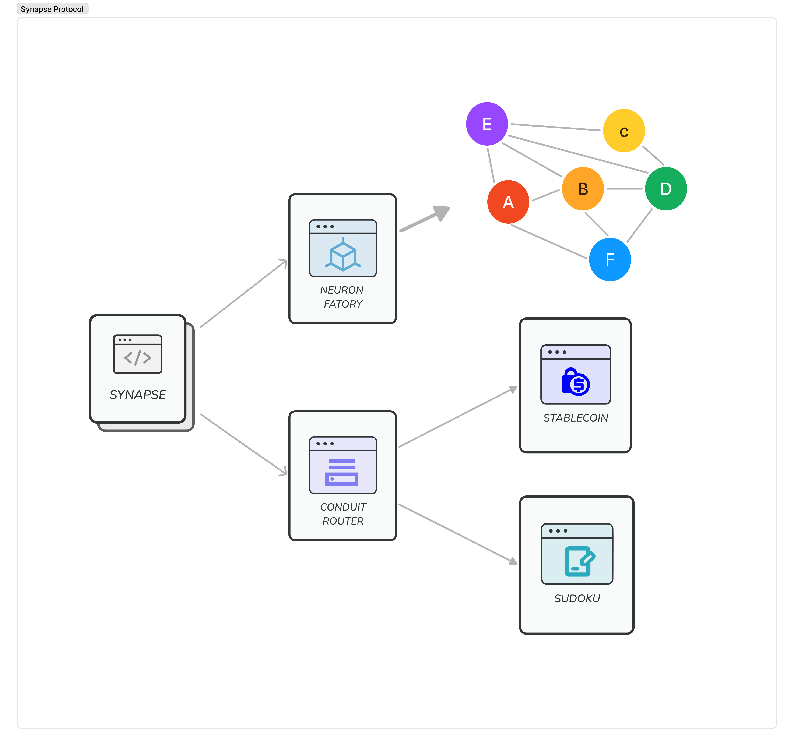
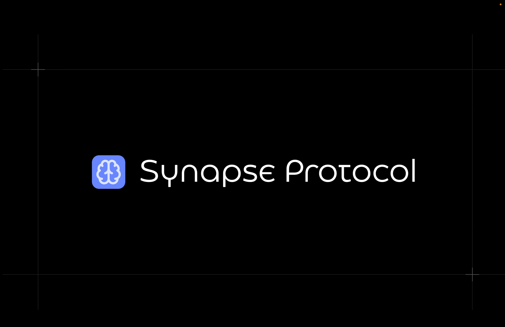
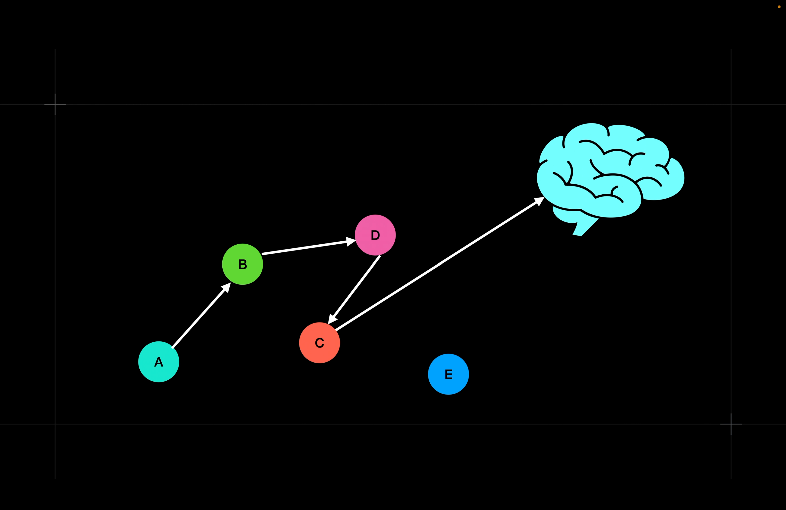
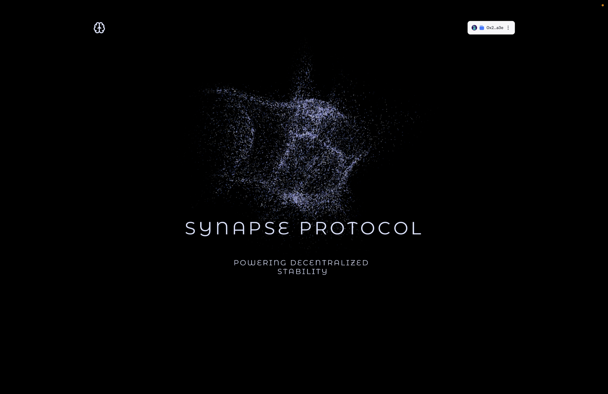
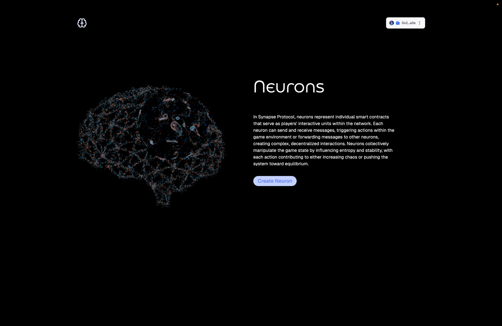
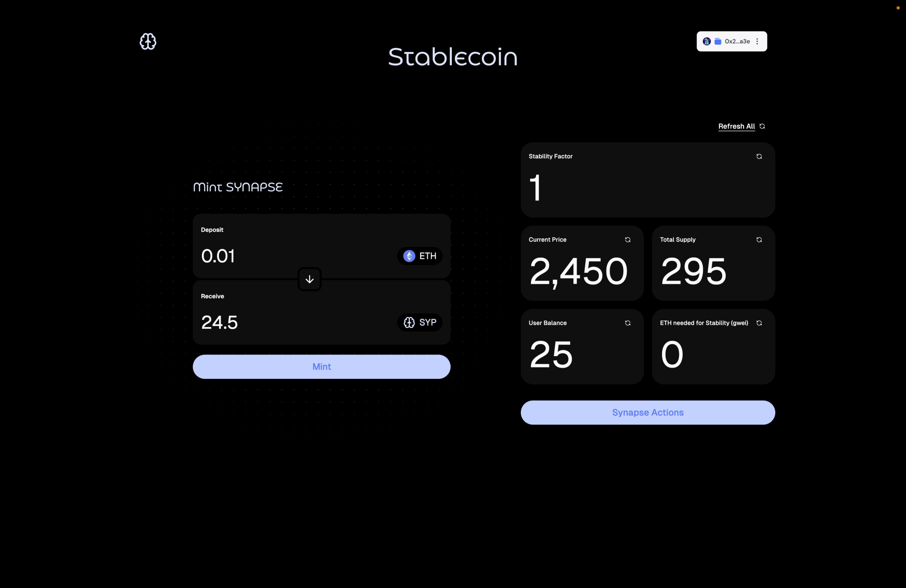
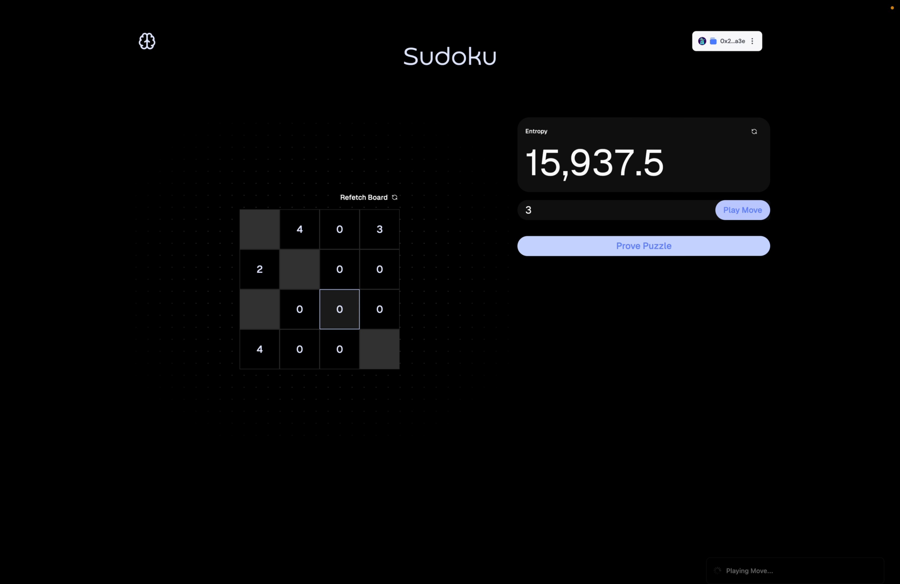

Synapse Protocol is a decentralized Stability Protocol which aims to provide stability to complex systems. It is based on fundamental theory called Chaos Theory which states that complex systems are inherently unstable and can be stabilized by introducing a small amount of chaos. Synapse Protocol uses a combination of Chaos Theory and Neuron-based Messaging to stabilize the system.

## Architecture 🏗️

## How it works 🛠️

### Neuron Based Architecture

The protocol follows a neuron based messaging similar to our brain where:

- Each player is represented by a neuron, a smart contract capable of sending messages to other neurons.
- Neurons can also send messages to the central Synapse contract, which acts as the entry point and coordinator for the system.
- A neuron can forward messages to other neurons, creating a recursive chain of communication, affecting the global state and creating complex interactions.
- With each forwarded message, the system's entropy increases, introducing more unpredictability into the overall game state. However, this added chaos is necessary to drive the system towards stability

---

### Conduits

Conduits are apps which require stability and can be stabilized by the Synapse Protocol. Conduits can be anything from a simple game to a complex financial system. This demo provides two demo conduits:

1. Stablecoin
2. Sudoku Game (Zero-Knowledge based Game)

---

### Passing Messages

Messages are passed through neuron based messages, where a neuron can pass message to another neuron or directly to the synspse. This behavior can also be used to pass messages through a chain of neurons and then to a synapse connection to introduce stability in the global state.

For example for the stablecoin contract, when the Mock USD price decreases the stability factor decreases. Then neuron can contribute to increasing the stability factor by sending a message to the synapse contract. The synapse contract then sends a message to the stablecoin contract to increase the stability factor by depositing ether against stablecoin.

---

### Contract Architecture

The Proof of Concept of the Protocol is live on Scroll Sepolia Testnet. The contract architecture is as follows:

- `Synapse Contract` - The main contract which acts as the entry point and coordinator for the system.
- `Neuron Factory` - A factory contract to create new Neurons contracts.
- `Stablecoin` - A demo conduit which is a simple stablecoin contract with a stability factor.
- `Sudoku` - A demo conduit which is a simple Sudoku game with a zero-knowledge proof where main goal it to increase entropy of the system.

Deployed Links:

- Synapse Contract: [0xFcF42e40E1768871F52D50b408427B508295a0C3](https://sepolia.scrollscan.com/address/0xfcf42e40e1768871f52d50b408427b508295a0c3)
- Neuron Factory: [0xcBD2c5849A456f19D8D0a6B2Ca9fD9d8CEc395c3](https://sepolia.scrollscan.com/address/0xcBD2c5849A456f19D8D0a6B2Ca9fD9d8CEc395c3)
- Sudoku: [0x348613ce6ABD97eb63066d9C9492Bdd24AeE73D8](https://sepolia.scrollscan.com/address/0x348613ce6ABD97eb63066d9C9492Bdd24AeE73D8)
- Sudoku Ultraverifier: [0xFB2c8E8885Ce8eA8cCa2e7B2baDa1B89834287Cb](https://sepolia.scrollscan.com/address/0xFB2c8E8885Ce8eA8cCa2e7B2baDa1B89834287Cb)
- Stablecoin: [0x5418A7Bf966E9026eE5D1b6651340c62a8f536D8](https://sepolia.scrollscan.com/address/0x5418A7Bf966E9026eE5D1b6651340c62a8f536D8)
- MockPrice Feed: [0x2b3C906AB66e67a972FB44872bca0B95a55EFF36](https://sepolia.scrollscan.com/address/0x2b3C906AB66e67a972FB44872bca0B95a55EFF36)

---

### Account Abstraction

The entire demo use account abstraction using integration with Dynamic Wallets and Alchemy Light Accounts with Pimlico Paymaster for smooth UX.

---

## Demo Video 🎥

## Screenshots 📸

<table>
  <tr>
    <td valign="top" width="50%">
       
      
    </td>
    <td valign="top" width="50%">
       
      
    </td>
  </tr>
</table>

<table>
  <tr>
    <td valign="top" width="50%">
       
            
    </td>
    <td valign="top" width="50%">
       
            
    </td>
  </tr>
</table>

<table>
  <tr>
    <td valign="top" width="50%">
       
            
    </td>
    <td valign="top" width="50%">
       
            
    </td>
  </tr>
</table>

## 🧑🏼‍💻 Tech Stack

- **Frontend**: Next.js, Tailwind CSS, `@shadcn/ui`
- **Integration**: `wagmi`, `web3modal`, Dynamic Wallet, Alchemy, Pimlico
- **Smart Contracts**: Solidity, Foundry, Forge

---
